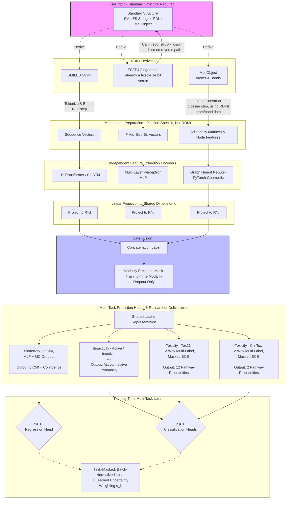

# Synposis

Our goal for MuFu is for it to be able to make precise and accurate chemical property predictions for an arbitrary compound given its molecular structure. As of now, we are targetting prediction on certain bioactivity and toxicity measures as they are particularly useful to chemists and computational biologists, and there are various datasets for this type of prediction task.

MuFu is a **single shared model**: one set of encoders and a fused latent representation feed all prediction heads (bioactivity and toxicity alike), rather than training separate models per property. This is what lets structural patterns learned from one task (e.g. binding affinity) inform predictions on another (e.g. toxicity), rather than losing that shared signal across isolated models.

# IO and Data

## Input

There are various ways to convey the same molecule's structure [^1]. We choose three allowed representations for model input (in any combination), and each is a different data type:

- SMILES strings -> sequential data
- Molecular fingerprint -> fixed-bit vector data
- Molecular graphs -> topological data

Different deep learning techniques are better suited for feature extraction from different types of data. Because SMILES, fingerprint, and graph are all deterministic functions of the same underlying structure, they **aren't** independent sources of new information; that is, no encoder can learn something about a molecule that isn't, in principle, recoverable from the others. The benefit of training on all three instead comes from **inductive bias diversity** [^18]; a transformer over SMILES tokens, an MLP over fixed hash bits, and a GIN over the actual bond graph will each pick up on different aspects of structure more easily than the others. This poses a problem though, as each model will "learn" different information, patterns, and features, alluding to the need for some kind of way to aggregate what each model learns and make predictions on each's findings. That way "knowledge" gained isn't lost.

What allows us to ingest a compound is that we use RDKit to derive all three representations at both train and inference time (see **Training Data** below) from a single structure, so no input is ever missing in production (see **Architecture: Late Fusion with Modality Dropout**).

- NOTE: ECFP is a lossy hash of substructures, so it can't be used to reconstruct a SMILES string or molecular graph. Meaning a compound's input can't be a fingerprint-only. Our ingestion pipeline therefore starts from a standard structure, like SMILES or RDKit `Mol` object. A fingerprint may be _derived_ from it, but never treated as the sole starting input.

## Output

Apart from making predictions on a compound's bioactivity and toxicity, we'll also be attaching a **confidence score** for regression predictions, and a **multi-task classification probability** for classification predictions (duh).

NOTE: Models don't do well when trying to predict values that lie in an enormous range due to large gradients. Each of the continuous measures MuFu predicts spans multiple orders of magnitude. To address this issue, we use their log-scaled version.

### Bioactivity Measures

Regression:

- $pIC_{50} = -\log_{10}(IC_{50})$
  - The negative base-10 logarithm of **inhibitory concentration** ($IC_{50}$).
  - **Inhibitory concentration** is the concentration of a chemical or compound required to reduce a specific biological or biochemical function by 50%.

Classification:

- **Active/Inactive Binary Classification**. Will get derived from the above $pIC_{50}$ labels by applying a potency threshold like $pIC_{50} > 5$, $IC_{50} < 10\mu M$ (rather than from a separate labeled dataset).
  - NOTE: exact threshold is target/assay-dependent, so treat as an experiment to determine the particular threshold (see **C. Data Splits & Benchmarking Metrics**).
  - NOTE: active compounds are typically a minority of ChEMBL, so this head will need the same class-imbalance handling (weighted BCE) as the following toxicity head.

### Toxicity Measures

Classification:

- **Multi-Task Binary Classification**. for each of the 14 targets below, the model will output a probability $\in [0, 1]$ that the compound is toxic on that specific pathway.
  - Tox21: 12 binary pathway targets (active/inactive) across nuclear receptor and stress-response pathways.
  - ClinTox: 2 binary targets are clinical toxicity-driven trial failure vs. FDA approval.

## Multi-Modal Fusion

Our model will follow a **Multi-Modal Fusion Architecture** (hence MuFu!) so we can allow the combination of different molecular representations as input, and combine learned representations/features from training for stronger prediction. Specifically, we utilize Late Fusion with Modality Dropout (go into this more in the **Architecture: Late Fusion with Modality Dropout** section).

ChEMBL compounds don't have Tox21 or ClinTox labels, and vice versa. Because bioactivity and toxicity labels come from disjoint sets of compounds, the shared model uses a **per-example task mask** at the loss level. This ensures each example only contributes a gradient to the heads its labels actually cover.

Li et al. (2025) [^9] provide precedent for our core multi-task design. They show a shared Multi-Task Learning (MTL) model predicting several correlated blast-loading parameters outperforms training separate Single-Task Learning (STL) models per parameter, particularly when labeled data is scarce. MuFu follows this same idea. We share one trunk across bioactivity and toxicity rather than training isolated models per property.

- NOTE: Their setup doesn't map onto ours directly. Every example in their dataset carries labels for each blast parameter simultaneously. Their multi-task benefit comes from correlated regression outputs learned from the same fully-labeled input, so no per-example task masking is needed. Our setting is more challenging. ChEMBL and Tox21/ClinTox are disjoint compound sets, therefore no example ever carries labels for both bioactivity and toxicity at once. The per-example task mask above exists specifically to handle this gap, which their architecture never has to address.

## Training Data

To train our model, we'll use open-source, highly benchmarked datasets available through the computational chemistry community. We'll use **RDKit** to convert base structures from these datasets into the three required input formats (SMILES, ECFP4 fingerprints, and PyG graphs).

### Bioactivity Task Data

- [ChEMBL](https://www.ebi.ac.uk/chembl/)
  - Target: **Continuous Regression ($pIC_{50}$)** and **Active/Inactive Classification**
    - Dataset: We'll get target-specific binding affinity assays (BACE-1 or EGFR kinase baseline benchmarks maybe), then filter for those with quantitative $IC_{50}$ metrics.
    - Training the bioactivity model on this data forces the sequence, fingerprint, and graph encoders to map exact structural modifications to micro- and nanomolar binding shifts (needed for medicinal chemistry tasks).
  - NOTE: ChEMBL $IC_{50}$ values are reported in mixed units (nM, µM, etc.). The ChEMBL ingestion script must standardize all values to molar before applying the log-scale transformation, or $pIC_{50}$ values won't be comparable across assays.

### Toxicity Task Data

For toxicity benchmarking, we'll pull standardized subsets from **MoleculeNet** [^2] project via DeepChem ([link to dataset loading API](https://deepchem.readthedocs.io/en/latest/api_reference/moleculenet.html)) or HuggingFace.

- [Tox21](https://tox21.gov/)
  - Target: **Multi-Task Binary Classification** (12 cellular pathways)
  - Dataset: 8014 unique environmental compounds and FDA-approved drugs. The targets measure pathways like nuclear receptor disruption (estrogen, androgen, p53 stress response) and cellular toxicity.
- ClinTox [^2]
  - Target: **Multi-Task Binary Classification** (2 pathways)
  - Dataset: A set of 1,477 compounds comparing drugs that failed clinical trials due to real bad toxicity side-effects against drugs that got FDA approval.
  - NOTE: This data helps train the model to recognize clinical safety liabilities that go beyond simple cell-line assays.

### Data Splits & Benchmarking Metrics

#### Data Split

We do a 80/10/10 train/validation/test ratio with Scaffold Splitting:

- **Scaffold Splitting** is where compounds are grouped by their Bemis-Murcko scaffold [^11] and then whole groups are assigned to a single split.
  - Prevents near identical compounds (structurally) from leaking between train and test, giving a more honest measure of generalization to novel scaffolds.
  - NOTE: A recent study from Guo et al. (2024) [^12] indicates that scaffold splitting overestimates virtual screening performance and suggests using a **UMAP-based clustering split** as an alternative. May implement on a later iteration.

#### Bioactivity Evaluation

- **Root Mean Squared Error (RMSE)** and $R^2$ accuracy for the regression head
- **ROC-AUC** for the active/inactive classification head, with the potency threshold to be determined from experimentation across multiple literature-backed, candidate thresholds.

#### Toxicity Evaluation

- **ROC-AUC Score** averaged across all validated pathways.

#### Batching Strategy

- **Mixed batching** since it keeps the shared trunk's gradient signal balanced across both tasks every step.
  - ChEMBL and Tox21/ClinTox examples combined in the same batch, via a weighted/stratified sampler
- NOTE: can A/B **mixed batching** with **separated/alternating batching**, where batches are drawn from one dataset at a time. It's easier to debug per task, but risks the shared trunk oscillating between task-favorable representations (rather than converging).

# Architecture: Late Fusion with Modality Dropout

To allow input to be any arbitrary combination of the three data types, we'll use a **Late Fusion Architecture** [^8]. Because RDKit always derives all three representations from whichever canonical structure is ingested, no modality is ever actually missing during inference. Though, we still train with an **Input Modality Dropout** [^13] layer purely as a regularizer so the network doesn't lean entirely on whichever encoder converges fastest (lets the other two undertrain).

- **Input Modality Dropout** randomly zeroes one or two modalities during training even though all are available.
- Fingerprint MLP typically converges the fastest.

## Input Modalities & Encoders

The network will run three parallel feature extraction pipelines before concatenating representations at a central bottleneck.

- Modality A: SMILES String (Sequence)
  - Input: Variable length character tokens (mapped with a dictionary of allowed chemical tokens).
  - Encoder Network: **1D Transformer Encoder** (MoLFormer [^3], ChemBERTa-2 [^4]) or **Bi-directional LSTM** (Li et al. [^7])
    - NOTE: worth A/B testing 1D Transformer and BiLSTM as both show strong results for sequence encoding.
  - Output Vector: $Z_{\text{smiles}} \in R^{d}$
- Modality B: Molecular Fingerprint (Fixed Vector)
  - Input: 1024 or 2048-bit binary vector generated using RDKit (ECFP).
  - Encoder Network: Fully Connected **Multi-Layer Perceptron (MLP)** with Layer Normalization and Dropout [^14] [^15].
  - Output Vector: $Z_{\text{fingerprint}} \in R^{d}$
- Modality C: Molecular Graph (Topological Grid)
  - Input: Pytorch Geometric graph object (`Data`) where nodes = heavy atoms (atom type, formal charge, hybridization, valence, chirality, and aromaticity flag), edges = chemical bonds (single, double, triple, or aromatic; includes bond stereochemistry for E/Z or cis/trans configurations).
  - Encoder Network: **Graph Isomorphism Network (GIN)** [^5] [^6] or **Graph Convolutional Network (GCN)**.
    - NOTE: GIN seems to be superior to GCN [^5]
  - Output Vector: $Z_{\text{graph}} \in R^{d}$ (sum pooling over nodes).

**Projection to shared dimension:** the transformer (or BiLSTM), MLP, and GIN encoders won't naturally agree on output width, so each encoder is followed by its own linear projection layer mapping its pooled output to the common dimension $d$. The post-projection $Z \in R^d$ from each modality is what gets passed into the Late Fusion.

## Late Fusion Strategy

During training, if a modality is dropped for a given example, its vector is zeroed out. To prevent the network from biasing toward empty spaces, a **Modality Presence Mask** $M \in \{0, 1\}^3$ accompanies the layer during training; at inference, $M$ is always $(1,1,1)$ since we use RDKit to guarantee all three representations are present.

$$
\text{Fused Latent } L = \text{Concatenate}(Z_{\text{smiles}} \cdot M_0, \; Z_{\text{fingerprint}} \cdot M_1, \; Z_{\text{graph}} \cdot M_2)
$$

The fused vector $L$ is passed to a dense Layer Norm block before splitting into multi-task prediction heads.

## Prediction Heads and Multi-Task Loss Functions

The shared latent $L$ feeds the following three outputs:

- **bioactivity regression** ($pIC_{50}$)
- **bioactivity classification** (active/inactive)
- **toxicity multi-label classification** (Tox21 12 pathways, ClinTox 2 pathways)

Because ChEMBL and Tox21/ClinTox are disjoint sets of compounds, each example only contributes loss to the heads its respective dataset actually has labels for. We apply a **per-example task mask** ($m^{\text{bio}}_i, m^{\text{tox}}_i \in \{0,1\}$) at the loss level, plus a finer-grained mask needed within the toxicity task:

- $m^{\text{tox}}_{i,p} \in \{0,1\}$ for $p \in \{1,\dots,14\}$: The existing per-pathway mask for Tox21's `NaN` labels applied consistently across all 14 pathways (12 Tox21 + 2 ClinTox).

**Within-task aggregation.** For a given example $i$, the toxicity loss is a **masked mean** over its valid pathways:

$$
\mathcal{L}_{\text{tox}}(i) = \frac{\sum_{p=1}^{14} m^{\text{tox}}_{i,p} \cdot \mathcal{L}_{\text{BCE}}(y_{i,p}, \hat{y}_{i,p})}{\sum_{p=1}^{14} m^{\text{tox}}_{i,p}}
$$

This should keep loss magnitude comparable between a compound with 10 valid Tox21 labels and a ClinTox compound with only 2. A masked sum would upweight examples just for having more labels present, independent of $m^{\text{bio}}_i / m^{\text{tox}}_i$ at the outer level.

**Batch-level normalization.** For each task $k$, the batch loss is a **masked mean over examples with that task present**:

$$
\mathcal{L}_k(\text{batch}) = \frac{\sum_{i \in \text{batch}} m^k_i \cdot \mathcal{L}_k(i)}{\sum_{i \in \text{batch}} m^k_i}
$$

Without this, batch composition (number of ChEMBL vs. Tox21/ClinTox in a batch) changes each task's effective loss magnitude independent of any learned weighting

- NOTE: This is an issue that gets worse if alternating batching is used (as opposed to mixed batching) since $\sum_i m^{\text{bio}}_i$ and $\sum_i m^{\text{tox}}_i$ would be mutually exclusive per batch.

**Cross-task weighting.** Rather than hand-tuning fixed weights $w_1, w_2, w_3$ via grid search (could go "stale" as losses shrink at different rates during training), MuFu-v1 **replaces** them entirely with **learned homoscedastic uncertainty weighting**. Following Kendall et al. [^10], we parameterize each task's weighting by a learned $s_k = \log \sigma_k^2$ (avoids numerical instability of $\sigma_k$ drifting toward zero during training):

$$
\mathcal{L}_{\text{total}} = \sum_{k} \left[ c_k \cdot e^{-s_k} \cdot \mathcal{L}_k(\text{batch}) + \frac{1}{2} s_k \right], \quad k \in \{pIC_{50},\ \text{bio-cls},\ \text{tox}\}
$$

$$
c_k = \begin{cases} \frac12 & k = pIC_{50} \\ 1 & k \in \{\text{bio-cls},\ \text{tox}\} \end{cases}
$$

- We use one $s_k$ per **dataset-level task** ($pIC_{50}$, bio-cls, tox), not a single scalar for all of toxicity. Tox21's pathways and ClinTox's clinical-outcome targets do not share the same noise characteristics, so one $\sigma_{\text{tox}}$ would assume otherwise. If per-pathway $s_k$ is too unstable, we'll switch to per-dataset (Tox21 vs. ClinTox) $s_k$.

**Confidence score:** for the bioactivity regression head, MuFu-v1 uses **MC-Dropout** [^16] (Monte Carlo Dropout) since it requires no architecture change beyond the dropout already present in the MLP encoder.

- **MC-Dropout** keeps dropout active at inference and runs multiple stochastic forward passes to estimate predictive variance, giving a measure of how confident the model is in a given prediction.
- NOTE: Deep ensembles and a heteroscedastic Gaussian NLL head (predicting mean + variance directly) are solid candidates to A/B against MC-Dropout in a later iteration.

## Diagram

# References

[^1]: Pang, C., Tong, H. H. Y., & Wei, L. (2023, November 20). _Advanced deep learning methods for molecular property prediction_. Quantitative biology (Beijing, China). https://pmc.ncbi.nlm.nih.gov/articles/PMC12807101/#qub223-sec-0190
[^2]: Zhenqin Wu, Bharath Ramsundar, Evan N. Feinberg, Joseph Gomes, Caleb Geniesse, Aneesh S. Pappu, Karl Leswing, Vijay Pande; MoleculeNet: a benchmark for molecular machine learning. Chem. Sci. 2018; 9 (2): 513–530. https://doi.org/10.1039/c7sc02664a
[^3]: Ross, J., Belgodere, B., Chenthamarakshan, V., Padhi, I., Mroueh, Y., & Das, P. (2022). Large-scale chemical language representations capture molecular structure and properties. _Nature Machine Intelligence_, _4_(12), 1256–1264. https://doi.org/10.1038/s42256-022-00580-7
[^4]: Ahmad, W., Simon, E., Chithrananda, S., Grand, G., & Ramsundar, B. (2022, September 5). _Chemberta-2: Towards Chemical Foundation models_. arXiv.org. https://ui.adsabs.harvard.edu/abs/2022arXiv220901712A
[^5]: Xu, K., Hu, W., Leskovec, J., & Jegelka, S. (2019, February 22). _How powerful are graph neural networks?_. arXiv.org. https://doi.org/10.48550/arXiv.1810.00826
[^6]: Davies, D. (2024, June 28). _What are graph isomorphism networks?_. W&B. https://wandb.ai/graph-neural-networks/GIN/reports/What-are-Graph-Isomorphism-Networks---Vmlldzo1MTExMTg5
[^7]: Li, C., Feng, J., Liu, S., & Yao, J. (2022). A novel molecular representation learning for molecular property prediction with a multiple smiles-based augmentation. _Computational Intelligence and Neuroscience_, _2022_, 1–11. https://doi.org/10.1155/2022/8464452
[^8]: Lu, X., Xie, L., Xu, L., Mao, R., Xu, X., & Chang, S. (2024). Multimodal fused deep learning for drug property prediction: Integrating chemical language and molecular graph. _Computational and Structural Biotechnology Journal_, _23_, 1666–1679. https://doi.org/10.1016/j.csbj.2024.04.030
[^9]: Li, Q., Li, L., Shao, Y., Wang, R., & Hao, H. (2025). A multi-task machine learning approach for data efficient prediction of blast loading. _Engineering Structures_, _326_, 119577. https://doi.org/10.1016/j.engstruct.2024.119577
[^10]: Kendall, A., Gal, Y., & Cipolla, R. (2018). Multi-Task Learning Using Uncertainty to Weigh Losses for Scene Geometry and Semantics. In _Proceedings of the IEEE Conference on Computer Vision and Pattern Recognition (CVPR)_, 7482–7491. https://doi.org/10.48550/arXiv.1705.07115
[^11]: Bemis, G. W., & Murcko, M. A. (1996). The properties of known drugs. 1. Molecular frameworks. _Journal of Medicinal Chemistry_, _39_(15), 2887–2893. https://doi.org/10.1021/jm9602928
[^12]: Guo, Q., Hernandez-Hernandez, S., & Ballester, P. (2024, September 18). _Scaffold splits overestimate virtual screening performance_. arXiv.org. https://arxiv.org/pdf/2406.00873
[^13]: Neverova, N., Wolf, C., Taylor, G., & Nebout, F. (2016). Moddrop: Adaptive multi-modal gesture recognition. IEEE Transactions on Pattern Analysis and Machine Intelligence, 38(8), 1692–1706. https://doi.org/10.1109/tpami.2015.2461544
[^14]: Mayr, A., Klambauer, G., Unterthiner, T., & Hochreiter, S. (2016). DeepTox: Toxicity prediction using Deep learning. _Frontiers in Environmental Science_, _3_. https://doi.org/10.3389/fenvs.2015.00080
[^15]: Ma, J., Sheridan, R. P., Liaw, A., Dahl, G. E., & Svetnik, V. (2015). Deep neural nets as a method for quantitative structure–activity relationships. _Journal of Chemical Information and Modeling_, _55_(2), 263–274. https://doi.org/10.1021/ci500747n
[^16]: Gal, Y., & Ghahramani, Z. (2016, October 4). _Dropout as a bayesian approximation: Representing model uncertainty in Deep learning_. arXiv.org. https://doi.org/10.48550/arXiv.1506.02142
[^17]: Pang, C., Wang, Y., Jiang, Y., Wang, R., Yao, X., Zou, Q., Zeng, X., Su, R., & Wei, L. (2025). Multiview deep learning-based molecule design and structural optimization accelerates inhibitor discover. IEEE Transactions on Neural Networks and Learning Systems, 36(8), 14022–14036. https://doi.org/10.1109/tnnls.2024.3506619
[^18]: Zhu, Y., Chen, D., Du, Y., Wang, Y., Liu, Q., & Wu, S. (2022, September 29). _Improving molecular pretraining with complementary featurizations_. arXiv.org. https://doi.org/10.48550/arXiv.2209.15101
